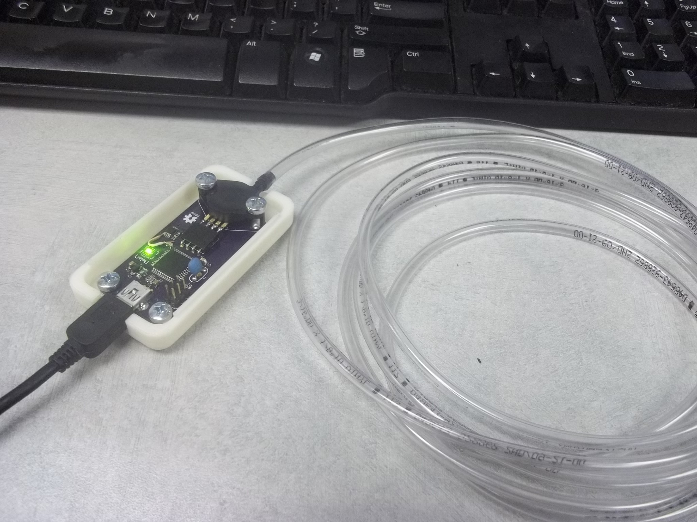

# openSip+Puff

__openSip+Puff__ aims to provide a cheap, simple, open and modern alternative input method based on the breath of a user that can be easily mapped to a variety of common actions like mouse clicks and keypresses.

The ultimate goal of this project is to go beyond simple utilitarian functionality and provide a new modality for creative expression that is meaningful for people with or without limited mobility. For me this means musical expression and visual art applications, but you are welcome to take it in whatever direction you want!

---

## Features
### Hardware
The core functionality of this project is built upon the capabilities of the [ATmega32U4 microcontroller](https://github.com/jasonwebb/openSipPuff/blob/master/datasheets/ATMega32u4.pdf) running the [Arduino Leonardo bootloader](https://www.arduino.cc/en/Main/ArduinoBoardLeonardo) paired with an analog pressure sensor.

Currently this project uses the [MPX12GP](https://github.com/jasonwebb/openSipPuff/blob/master/datasheets/MPX12.pdf) pressure sensor from Freescale, which requires an instrumentation amplifier in order to interface with the microcontroller. However, this sensor has proven to be hard to integrate into a manufacturable design, so I will be experimenting with another sensor very soon.

### Firmware
Thanks to the [Arduino Leonardo bootloader](https://www.arduino.cc/en/Main/ArduinoBoardLeonardo), __openSip+Puff__ can mimic generic USB devices such as keyboards, mice, game controllers, or musical instruments allowing data from the pressure sensor to be associated with real actions on the user's computer.

The current firmware uses a rather crude data structure stored in EEPROM to do this association, but I am hoping to come up with a more elegant solution over time. If you know of a good way to do this, please consider detailing your idea in an Issue or a fork!

### Software
Currently whenever an end user wants to change how pressure data events are associated with keyboard/mouse/etc behaviors they need to dive into the firmware code, make alterations and upload a fresh sketch. For developers this is pretty trivial, but I ultimately want this process to be easier for non-developers.

Therefore my current plan is to experiment with [Electron](http://electron.atom.io/) to build a modern, cross-platform desktop application using web technologies to create a simple, intuitive interface that allows for easy reconfiguration of the board over a transparent serial connection.

---

### Relevant links
* Wiki article on my personal wiki: http://jason-webb.info/wiki/index.php?title=OpenSip%2BPuff
* All my blog posts about it: http://jason-webb.info/tag/openSipPuff
* Hackaday.io project: https://hackaday.io/project/12959-opensippuff
---

### Photos

